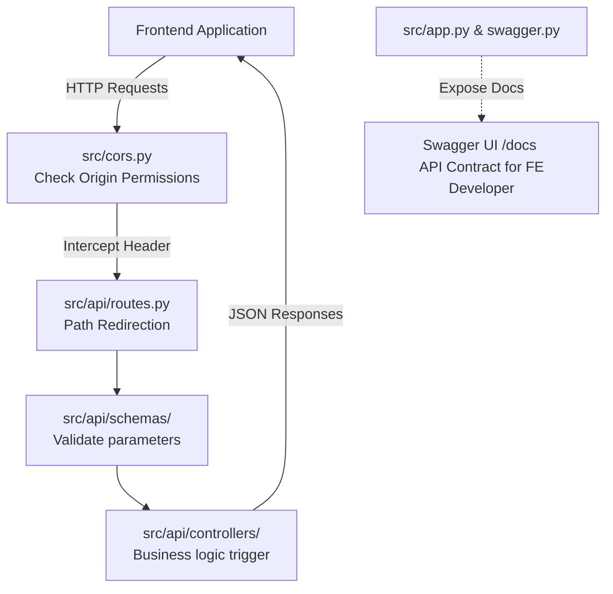

# Báo Cáo Phân Tích Cấu Trúc Backend (Clean Architecture)

Tài liệu này phân tích chi tiết cấu trúc thư mục của mã nguồn Backend nằm trong thư mục `src` theo mô hình thiết kế **Clean Architecture** (Kiến trúc sạch). Đồng thời, tài liệu sẽ chỉ rõ các thành phần chịu trách nhiệm liên kết trực tiếp với Frontend (FE).

---

## 1. Bản Đồ Cấu Trúc Thư Mục `src`

Dưới đây là sơ đồ tổng quan thiết kế mã nguồn của dự án:

```bash
src/
├── api/                     # Lớp Giao Diện Lập Trình (API Layer) - Liên kết trực tiếp với FE
│   ├── controllers/         # Xử lý các request từ FE và điều phối luồng xử lý dữ liệu
│   ├── schemas/             # Định nghĩa cấu trúc, xác thực (validation) dữ liệu gửi từ FE và trả về FE
│   ├── middleware.py        # Các bộ lọc trung gian xử lý request/response (logging, CORS, errors,...)
│   ├── routes.py            # Khởi tạo và đăng ký các nhóm đường dẫn (Blueprints)
│   ├── requests.py          # Hỗ trợ định nghĩa cấu trúc dữ liệu đầu vào
│   ├── responses.py         # Chuẩn hóa cấu trúc dữ liệu phản hồi trả về FE
│   └── swagger.py           # Thiết lập tài liệu đặc tả API động (Swagger Spec)
│
├── domain/                  # Lớp Nghiệp Vụ Cốt Lõi (Domain Layer) - Không phụ thuộc hệ thống bên ngoài
│   ├── models/              # Định nghĩa các thực thể logic của hệ thống (Entity) & Interfaces/Port
│   ├── constants.py         # Lưu trữ hằng số dùng chung toàn cục
│   └── exceptions.py        # Các lỗi nghiệp vụ tùy biến (Domain Exceptions)
│
├── infrastructure/          # Lớp Hạ Tầng (Infrastructure Layer) - Công nghệ chi tiết & Kết nối vật lý
│   ├── databases/           # Cấu hình kết nối DB vật lý (Postgres, MSSQL, SQL Server,...)
│   ├── models/              # Lớp đối tượng SQLAlchemy ánh xạ cơ sở dữ liệu (ORM models)
│   ├── repositories/        # Hiện thực hóa các Interface truy xuất dữ liệu từ DB (Adapter)
│   └── services/            # Tích hợp dịch vụ của bên thứ ba (SMS, Email, Maps API,...)
│
├── services/                # Lớp Điều Phối Nghiệp Vụ (Application Services Layer)
│   └── auth_service.py      # Xử lý tuần tự các Business Logic kết nối giữa API và DB Repository
│
└── [Cấu hình hệ thống]
    ├── app.py               # Điểm chạy chương trình chính (Entrypoint)
    ├── create_app.py        # Khởi tạo instance Flask (Application Factory pattern)
    ├── config.py            # Cấu hình môi trường (DB URI, JWT secrets, Swagger configs,...)
    ├── cors.py              # Cấu hình CORS - Cực kỳ quan trọng để liên kết với Frontend
    ├── dependency_container.py # Tiêm phụ thuộc (Dependency Injection container đơn giản)
    ├── error_handler.py     # Quản lý lỗi tập trung kiểm soát các HTTP Error Code
    └── app_logging.py       # Cấu hình log của ứng dụng
```

---

## 2. Nhiệm Vụ Chi Tiết Của Từng Thư Mục

| Tên Thư Mục | Tải Trọng Trách Nhiệm | Mô Tả Chi Tiết Nhiệm Vụ |
| :--- | :--- | :--- |
| **`src/api`** | **API & Giao Tiếp Client** | Nhận yêu cầu HTTP gửi đến ứng dụng, tiền xử lý, gọi các tầng nghiệp vụ xử lý dữ liệu và trả lại kết quả dạng JSON cho Frontend theo chuẩn HTTP status codes. |
| **`src/domain`** | **Core Domain (Pure Logic)** | Chứa các quy tắc nghiệp vụ cốt lõi mà dù thay đổi cơ sở dữ liệu hay thay đổi framework web thì các quy tắc này vẫn giữ nguyên. |
| **`src/infrastructure`** | **Adapters & Drivers** | Kết nối trực tiếp với công nghệ bên ngoài (Database Engine, Thư viện bên thứ ba). Đây là nơi viết các lệnh SQL, các truy vấn ORM để lấy dữ liệu thực tế từ PostgreSQL / SQL Server. |
| **`src/services`** | **Application Logic Orchestrator** | Đứng ở giữa làm cầu nối điều phối: lấy dữ liệu từ `infrastructure` (Repository), thực thi các nghiệp vụ kiểm tra logic thuộc về `domain`, rồi trả kết quả sạch sẽ lại cho `api`. |

### Chi tiết các thư mục con nổi bật:

*   **`src/api/controllers`**:
    Chứa các tập tin controller quản lý từng nhóm tính năng riêng biệt:
    *   `auth_controller.py`: Đăng ký, đăng nhập, phân quyền, cấp JWT Token.
    *   `customer_controller.py`: Quản lý thông tin khách hàng.
    *   `drone_controller.py`: Điều khiển, cập nhật tọa độ hoặc truy vấn tình trạng drone.
    *   `order_controller.py`: Tạo đơn hàng, duyệt đơn, tính toán lộ trình.
    *   `station_controller.py`: Quản lý danh sách, sức chứa của trạm hạ cánh.
    *   `delivery_controller.py`: Quản lý quy trình vận chuyển giao nhận drone.
    *   `chatbot_controller.py`: Giao tiếp với AI chatbot hỗ trợ người dùng.
    *   `notification_controller.py`: Phát thông báo qua điện thoại hoặc web app.
*   **`src/infrastructure/models`**:
    Các lớp ORM kế thừa từ `declarative_base()` ánh xạ 1-1 với cơ sở dữ liệu thực tế của hệ thống như `app_nguoi_dung`, `app_don_hang`, `app_drone`, `app_tram_ha_canh`. Cách viết này tách rời hoàn toàn với Entity thuần túy ở `src/domain/models` để tăng tính bảo mật và độc lập dữ liệu.

---

## 3. Các Thành Phần Thực Hiện Nhiệm Vụ Liên Kết Với Frontend (FE)

Để Frontend (React, Angular, Vue, Flutter, NextJS...) có thể liên kết và trò chuyện mượt mà với Backend, **4 thành phần** sau đây đóng vai trò quyết định:



### 3.1 Cấu Hình CORS (`src/cors.py`) — *Người gác cổng bảo mật*
*   **Chi tiết**: Ở môi trường thực tế, FE thường chạy trên cổng khác (ví dụ: `http://localhost:3000`) và BE chạy trên cổng `http://localhost:9999`. Trình duyệt web sẽ tự động chặn các cuộc gọi liên kết này do chính sách bảo mật (Same-Origin Policy).
*   **Vai trò**: `src/cors.py` sử dụng thư viện `flask_cors` cấu hình `origins: "*"` giúp vô hiệu hóa rào cản này, cho phép các mã Javascript chạy phía FE có thể gửi các HTTP Request (GET, POST, OPTIONS,...) đến backend mà không bị lỗi mạng.

### 3.2 Nhóm Controllers (`src/api/controllers/`) & Routes (`src/api/routes.py`) — *Đầu mối giao diện RESTful*
*   **Chi tiết**: Định nghĩa các API endpoints cụ thể (URL).
*   **Ví dụ**: Khi FE gọi `POST /auth/login` cùng với dữ liệu dạng JSON `{ "email": "...", "password": "..." }`, controller `auth_controller.py` tại endpoint `/auth/login` sẽ tiếp nhận request này để kiểm tra tài khoản, tạo mã JWT và đưa trả token về cho FE lưu trữ.

### 3.3 Marshmallow Schemas (`src/api/schemas/`) — *Nhân viên kiểm dịch dữ liệu*
*   **Chi tiết**: Chứa các tệp dùng để chuẩn hóa dữ liệu như `auth.py`, `order.py`, `customer.py`...
*   **Vai trò**:
    1.  **Request Validation**: Kiểm tra dữ liệu mà FE truyền lên có hợp lệ không (ví dụ: email có đúng cú pháp không, có thiếu trường bắt buộc nào không). Nếu sai, Schema sẽ trả lập tức về lỗi `400 Bad Request` dạng JSON chi tiết cho FE vẽ lên giao diện cho người dùng sửa.
    2.  **Response Serialization**: Lọc bớt các trường nhạy cảm trước khi gửi về FE. (Ví dụ: khi trả thông tin tài khoản về FE, schema sẽ loại bỏ trường mật khẩu băm `mat_khau_hash`, chỉ trả về `ho_ten`, `email`).

### 3.4 Swagger API Documentation (`src/app.py` & `/docs`) — *Hợp đồng cam kết API*
*   **Chi tiết**: Đoạn code thiết lập Swagger UI `/docs` và endpoint `/swagger.json` trong `src/app.py`.
*   **Vai trò**: Cung cấp giao diện trực quan hóa toàn bộ danh sách các API endpoints, cấu hình tham số truyền, dữ liệu mẫu trả về. Lập trình viên Front-End sẽ dựa hoàn toàn trên trang `/docs` để lập trình nút bấm, form điền dữ liệu tương quan khớp với Backend mà không cần phải đọc code Python.
